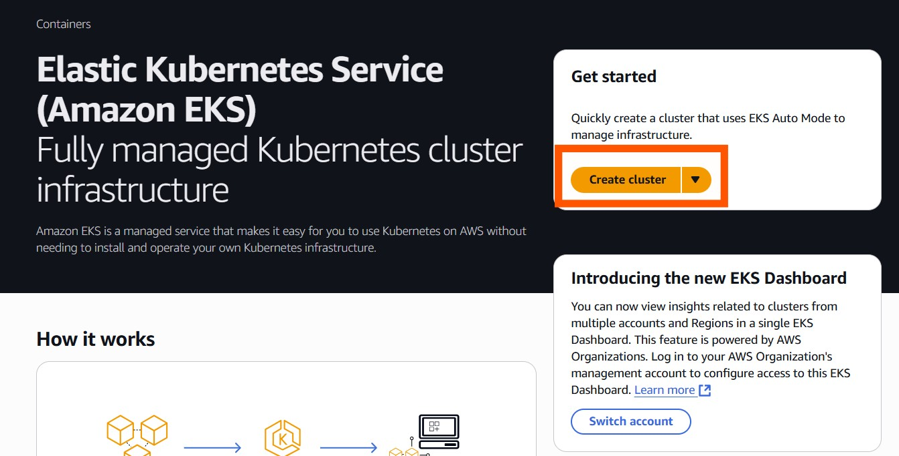
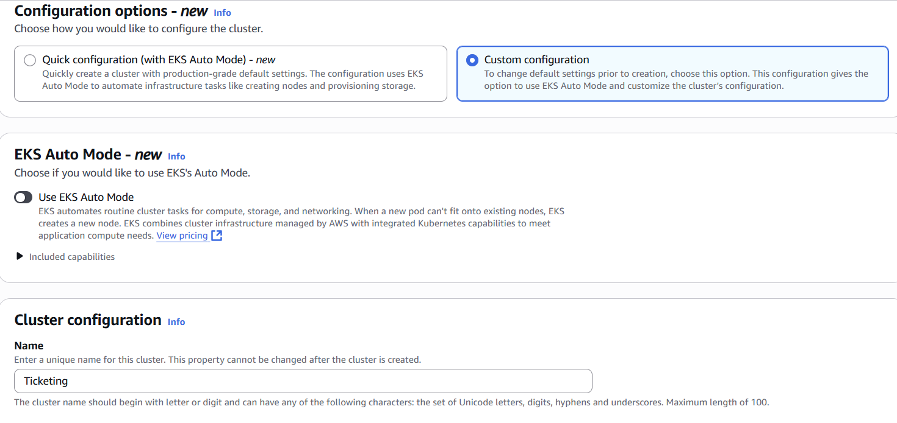
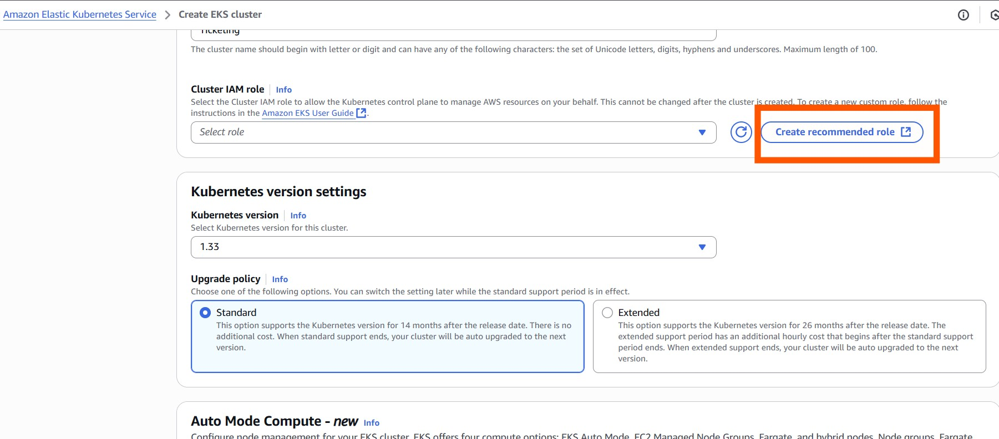
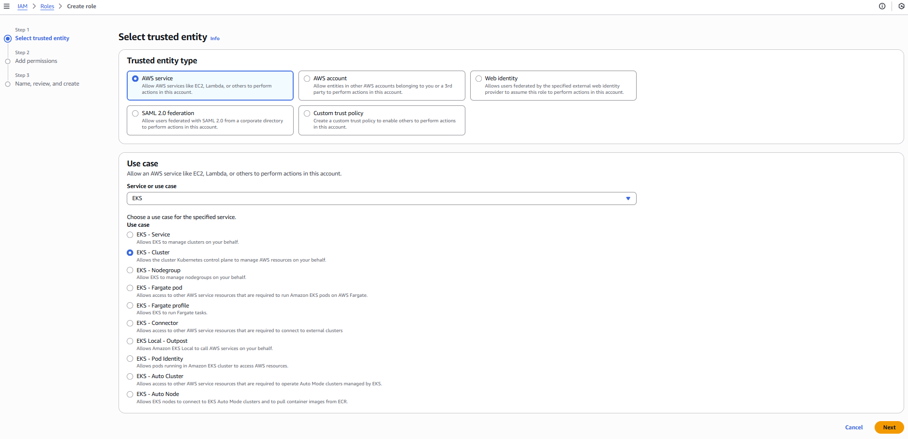
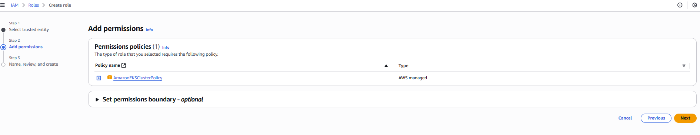
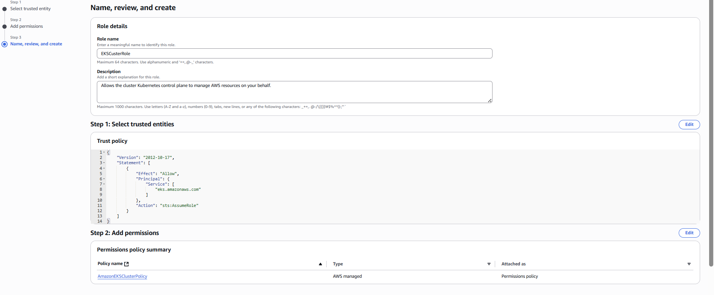

## Deployment

I have deployed the project on AWS Elastic Kubernetes Service (EKS) with the following steps:

### Create EKS Cluster

In AWS console, go to EKS and choose create cluster

### Choose configuration

Use the following options. In the CLuster IAM Role, Click create recommended role and follow the steps to create the required role. Once you name save the role, you can select it in the cluster IAM role.

make sure to name the role

[]
(https://www.youtube.com/watch?v=c9liExstdRI)
