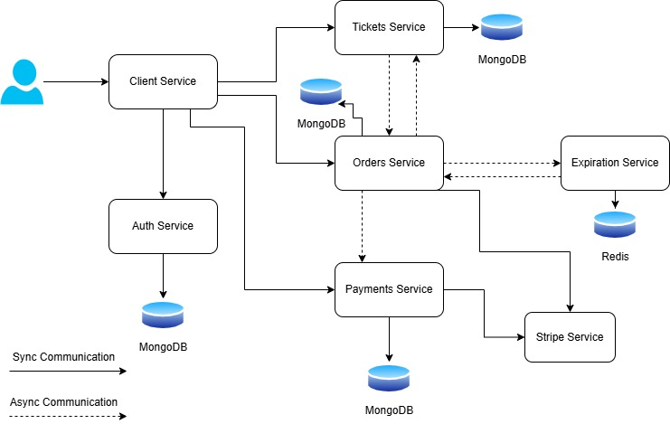
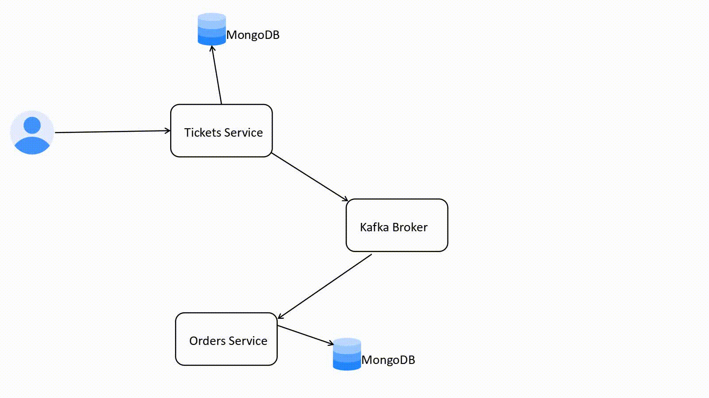
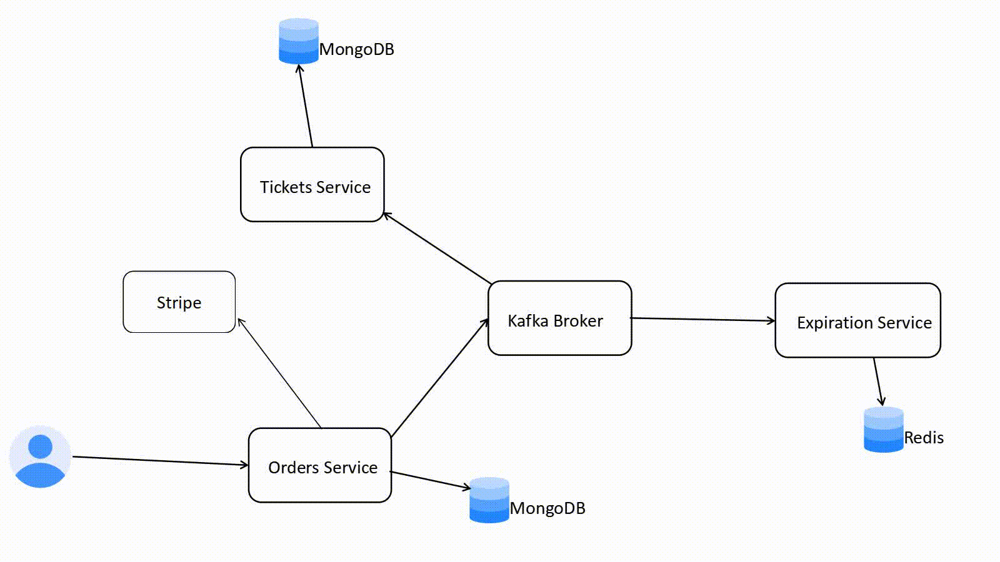
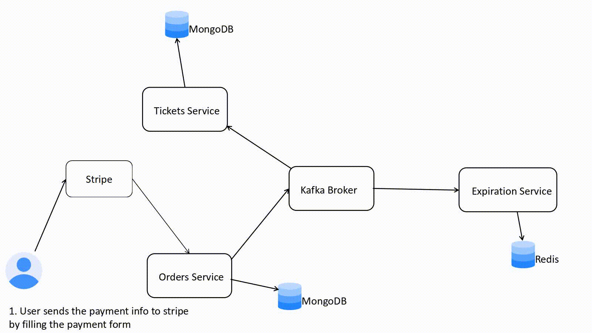
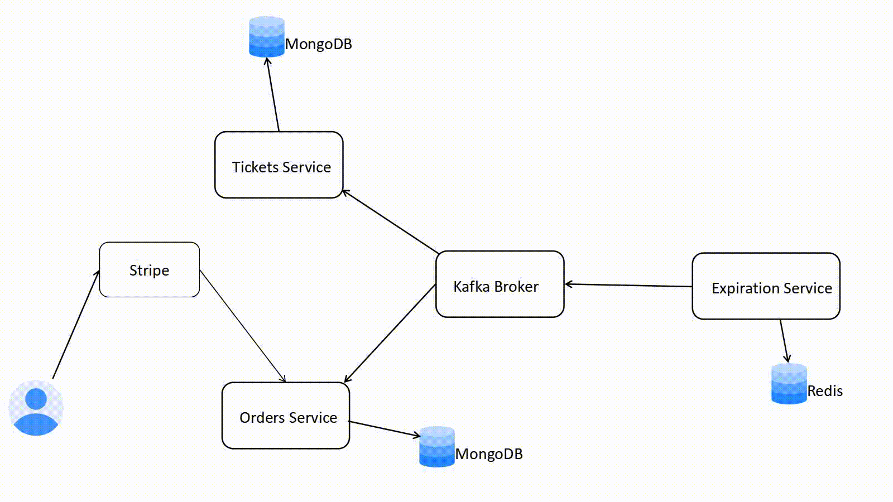
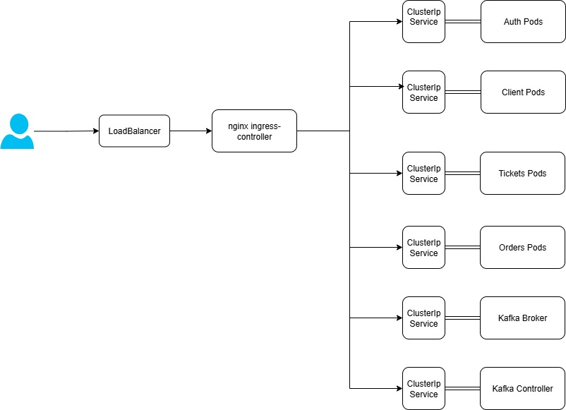

# 🎟️ Ticketing E-Commerce Platform (Microservices Architecture)

Thank you for taking the time to explore this project. The primary goal of this application is to learn and demonstrate how to build scalable systems using a **microservices architecture**.

This project is a simple **e-commerce platform** for buying and selling tickets. It consists of **six microservices** that communicate asynchronously through the **Apache Kafka** messaging system, all deployed on a **Kubernetes cluster** using **AWS EKS (Elastic Kubernetes Service)**.

---

## 🛠️ Tech Stack & Architecture

### 1. Frontend Service

- Built with **Next.js**, a React-based framework.
- Provides the UI for browsing, purchasing, and managing tickets.

### 2. Backend Services (5 Total)

- Services: `auth`, `orders`, `payments`, `expiration`, and `ticketing`.
- Developed using **Express.js** with **TypeScript**.
- Each service is independently deployed and versioned.

### 3. Databases

- **Redis** is used by the `expiration` service for managing TTL (time-to-live) of orders.
- **MongoDB** is used by the other services for persistent data storage.

### 4. Communication

- Microservices communicate **asynchronously** using **Apache Kafka** as the message broker.
- Events are published and subscribed across services to decouple business logic.

### 5. Deployment

- All services are containerized with Docker.
- Deployed on a **Kubernetes cluster** running on **AWS EKS**.

### 6. 🔁 CI/CD Pipeline

- **GitHub Actions** is used to automate the CI/CD process.
- On every push or pull request, workflows run to:
  - Lint and test the codebase
  - Build Docker images for services
  - Push Docker images to a container registry
  - Deploy updated services to the Kubernetes cluster
- This ensures fast and reliable delivery of changes across the platform.

### 7. Payments

- **Stripe** is integrated to handle secure payment processing during checkout.

---

## 📦 Project Goal

- Learn and apply best practices in **scalable distributed system design**.
- Gain hands-on experience with **Kubernetes**, **Kafka**, and **cloud infrastructure**.
- Understand how to manage **data consistency** and **event-driven communication** between microservices.
- Learn how to handle data concurrency issues with optimistic version control
- Learn how to do unit testing
- Learn how to create CI/CD pipeline with **github action**

## Project Architecture

The diagram below shows the App architecture

The async communication in the diagram above happens through kafka messaging system.

## Events

In this section you will find details of each events consumed and produced by each service

### Tickets Service Events

The tickets service produces the following events:

1. ticket-created event which is produced when the user creates a new ticket.
2. ticket-updated event which is produced when the user update the ticket

The tickets service listens to the following events:

1. order-created event: upon receiving the event, an order record is created in the tickets service database. The ticket is also marked as reserved by inserting the orderId in the orderId column of the ticket.
2. order-cancelled event: upon receiving the event, the ticket is marked unreserved by removing the orderID from the tickets

### Orders Service Events

The orders service produce the following events:

1. order-created, order-updated are published when the user create and update an order.
2. order-cancelled is published when the order service receive an expiration-complete event from the expiration service

The orders service listens to the following events:

1. Ticket-created and ticket updated.
2. Expiration-complete: upon receiving this event, if the order hasn't been completed yet, its status gets changed to cancelled,and a order-updated event is emitted.

### Expiration Service Events

The expiration service produce the following event:

1. Expiration complete event: this event is omitted when the order is expired.

The expiration service listens to the following event:

1. Order-created event: Once this event is received, an expiration job is put in the queue that gets processed after the order expires at time.

## Events Flow

In this section you can find the flow of events that can happen in the system

### User Creates a ticket

### User starts a ticket purchasing process (creating an order)

### User completes the payment

### Order expires before User completes the order

## Deployment

I have deployed the project on AWS Elastic Kubernetes Service (EKS). The following diagram shows the K8s cluster

